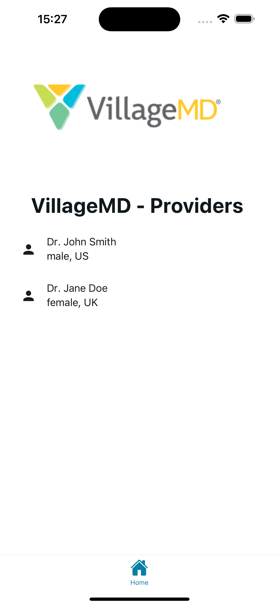

# Village Medical - Frontend Interview


## Introduction

This is a simple application that allows patients to search for providers in their area. The app is built using React-Native, Expo amd react-native-paper.

## Features

- Search for doctors by gender and nationality
  - Fetch providers using this mock API: https://randomuser.me/api/
  - Display the results in a list

## Get started

1. Install dependencies

   ```bash
   npm install
   ```

2. Start the app

   ```bash
    npx expo start
   ```

In the output, you'll find options to open the app in a

- [development build](https://docs.expo.dev/develop/development-builds/introduction/)
- [Android emulator](https://docs.expo.dev/workflow/android-studio-emulator/)
- [iOS simulator](https://docs.expo.dev/workflow/ios-simulator/)
- [Expo Go](https://expo.dev/go), a limited sandbox for trying out app development with Expo

You can start developing by editing the files inside the **app** directory. This project uses [file-based routing](https://docs.expo.dev/router/introduction).

## Api Documentation

#### Requesting Multiple Providers

[https://randomuser.me/api/?results=5](https://randomuser.me/api/?results=5)

#### Filter by nationality

[https://randomuser.me/api/?nat=us,gb](https://randomuser.me/api/?nat=us,gb)

#### Filter by gender

[https://randomuser.me/api/?gender=female](https://randomuser.me/api/?gender=female)

#### Pagination

[https://randomuser.me/api/?page=3&results=10&seed=abc](https://randomuser.me/api/?page=3&results=10&seed=abc)

#### API Errors

```json
{
  "error": "There was an error"
}
```

### Screenshots


